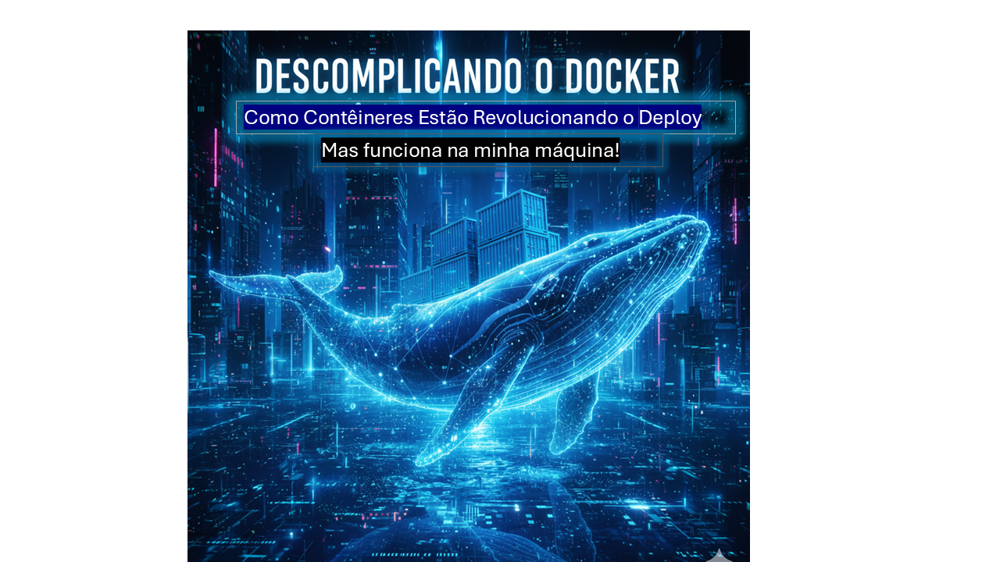

# Desafio DIO: Geração de Artigo Técnico com IA

Este repositório documenta o processo de criação de um artigo técnico utilizando ChatGPT e Gemini, como parte do desafio de projeto da DIO.

## 📝 Artigo Publicado

Você pode ler o artigo completo aqui:
**[Descomplicando o Docker: Como Contêineres Estão Revolucionando o Deploy](https://web.dio.me/articles/descomplicando-o-docker-como-conteineres-estao-revolucionando-o-deploy-1c7b7cf19599)**

---

## 🤖 Prompts Utilizados

Todos os prompts usados para gerar o texto e as imagens estão documentados no arquivo `meus_prompts.md`.

## 🖼️ Imagem de Capa

A imagem de capa utilizada foi gerada no Gemini e editada no PowerPoint.

